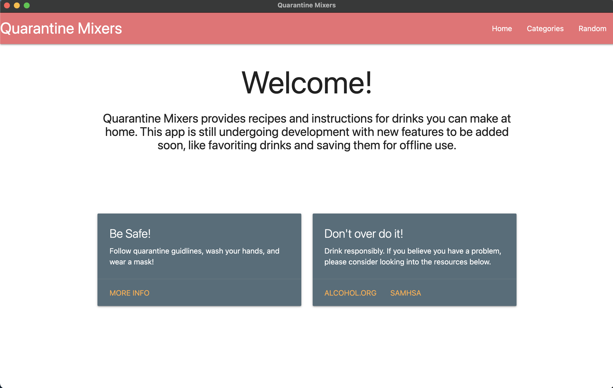
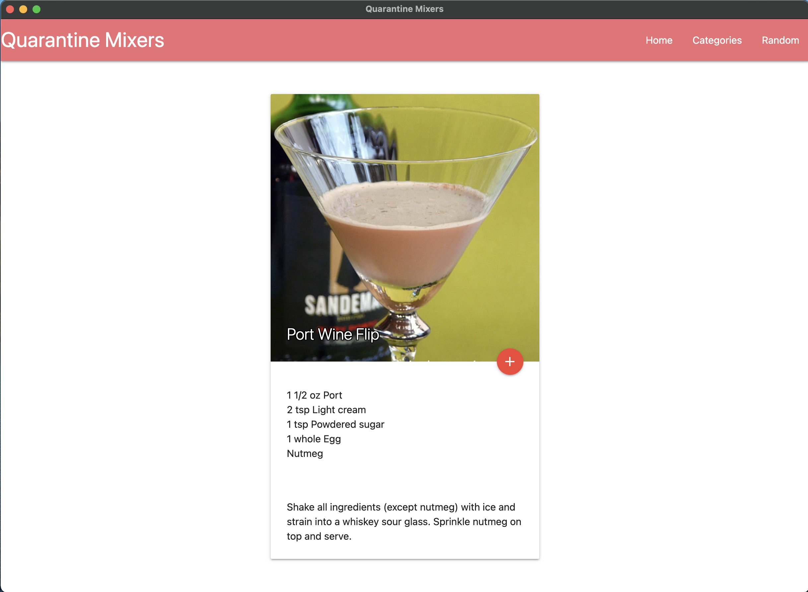
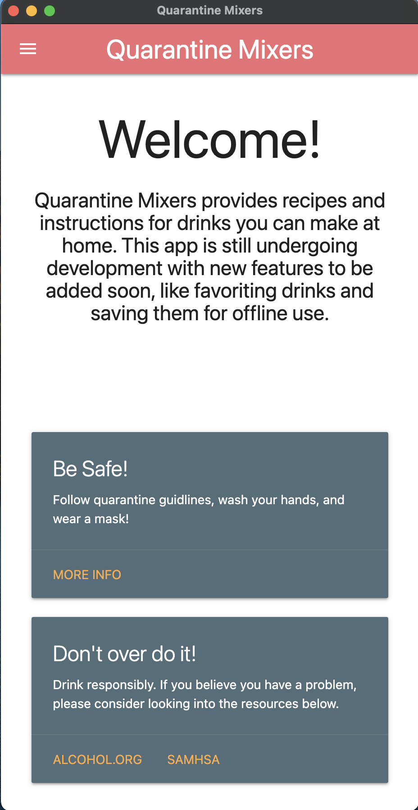
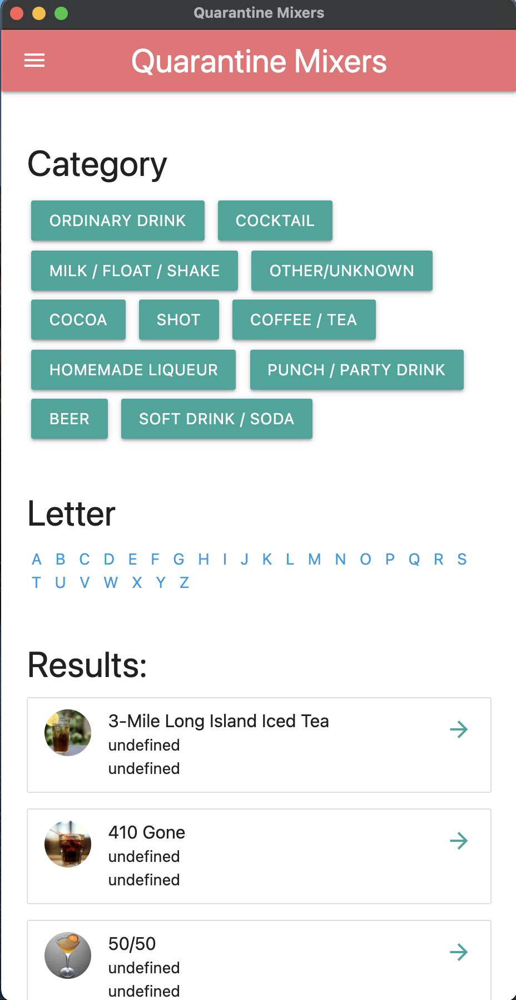

# Quarantine Mixers

### Made with Javascript, HTML, CSS, and Electron JS

## Goal

Become an in-home bartender when the bars are closed. 

Never let a virus get in the way of getting plastered. 

## How to use

- clone repository with 'git clone https://github.com/markahenrich/quarantine-mixers.git'
- run 'npm install' in the project directory 
- run 'npm start'

## Desktop

## Mobile
 
